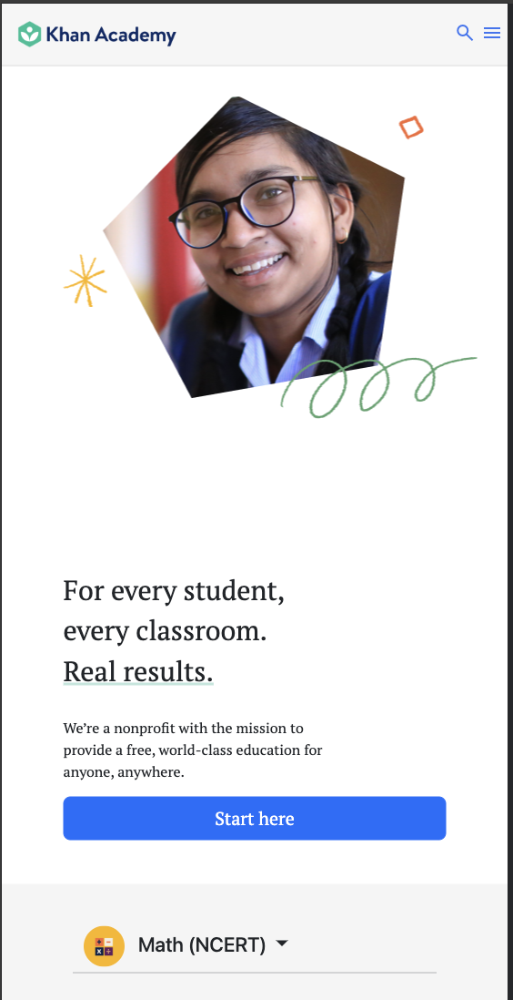
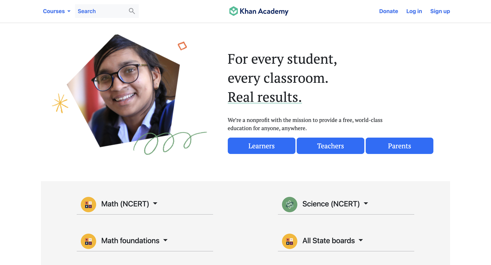

## Logic-Lakshya-2345

### Khan Academy

A personalized learning resource for all ages.
Khan Academy offers practice exercises, instructional videos, and a personalized learning dashboard that empower learners to study at their own pace in and outside of the classroom. We tackle math, science, computing, history, art history, economics, and more, including K-14 and test preparation (SAT, Praxis, LSAT) content. We focus on skill mastery to help learners establish strong foundations, so there's no limit to what they can learn next!

### Viatours

Viatours epitomizes a captivating online interface, meticulously crafted to deliver a seamless and vibrant journey through travel possibilities. At its core lies a sophisticated header, an inviting gateway to an array of exploratory wonders. Complemented by a sleek search bar, it beckons users to embark on their odyssey, beckoning them to seek out their desired destinations and experiences.

### Deployed Link

[Live Demo Khan Academy](https://khan-academy-clone-b34.netlify.app/) 
[Live Demo Viatours](https://project-learn-wise-figma-lakshya.netlify.app/)

### Screenshots

#### Khan Academy Mobile View

### Khan Academy Deskstop View

### Viatours Deskstop View

## Features

- **Navbar and Footer**: Both are responsive in nature and can be adjusted according to page width, providing consistent navigation and information throughout the page.
- **Dynamic Design**: A single-page component with fluid layout adjustments to accommodate different screen sizes, ensuring a seamless user experience.
- **Image with Overlay Text**: An image positioned between the navbar and footer, with translucent overlay text for added visual appeal.
- **Title and Banner**: Centered on the page and overlay, providing a focal point for the content.
- **Responsive Hamburger Menu**: Ensures accessibility and ease of navigation on smaller devices.

## Tech Stack

- **HTML**: Provides the structure and content for the web page.
- **CSS**: Handles the UI and styling, ensuring an appealing visual presentation.
- **SCSS**: SCSS is a CSS preprocessor that adds functionality like variables, nesting, and mixins

### Design Elements

1. **Media Queries:**
   Media queries are utilized to ensure the website's responsiveness across various screen sizes. By adjusting the layout and styling dynamically, the website offers an optimal viewing experience on different devices.

2. **Keyframes:**
   Keyframes are employed to create captivating animations within the website. By defining specific animation steps, keyframes enhance user engagement and interaction, providing a seamless browsing experience.

3. **Bootstrap:**
   Bootstrap is a popular HTML, CSS, and JS framework for developing responsive, mobile-first projects on the web. It features a grid system, components, and utilities for faster web design

4. **Responsive Design:**
   Utilizes media queries and flex layouts to adapt the page layout across various devices, ensuring a seamless browsing experience on mobile phones, tablets, and desktop computers.

5. **Fonts & Icons:**
   Integrates Google Fonts and FontAwesome icons for enhanced typography and visual elements. By leveraging these resources, the website achieves a modern and visually appealing design, improving readability and user engagement.

## How to Use

To run this project locally:

1. Clone this repository to your local machine.
2. Open the `index.html` file in your preferred web browser.
3. Explore the Lenovo and Viatours experience right from your device.

## Contributors

- [Subhankar Banik](https://github.com/subhankarbanik)
- [Adarsh Chaturvedi](https://github.com/Adarsh-ch)
- [Kranti Kumar](https://github.com/Kranti00)
- [Arijit Nath](https://github.com/Arijit9t7)
- [Syed Fahad Ali ](https://github.com/SyedFahadAli1)

## License

This project is licensed under the MIT License - see the [LICENSE](LICENSE) file for details.

## Acknowledgments

- Inspired by the beauty of travel and exploration.
- Special thanks to the supportive community at [Travelopia].
